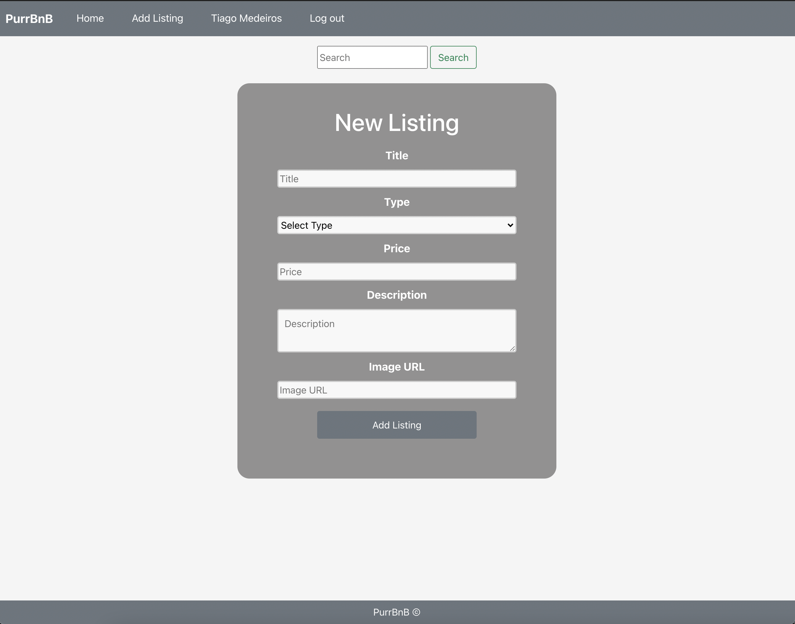
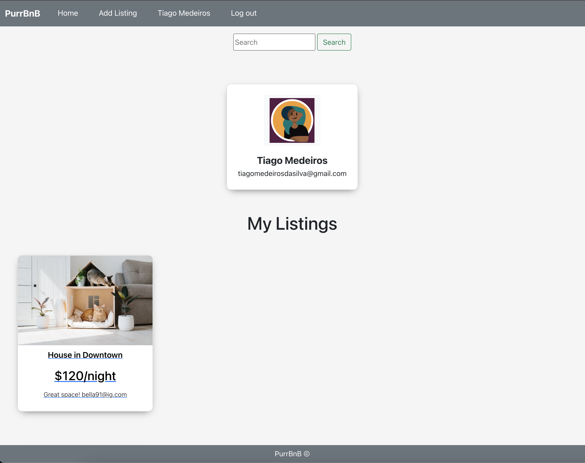
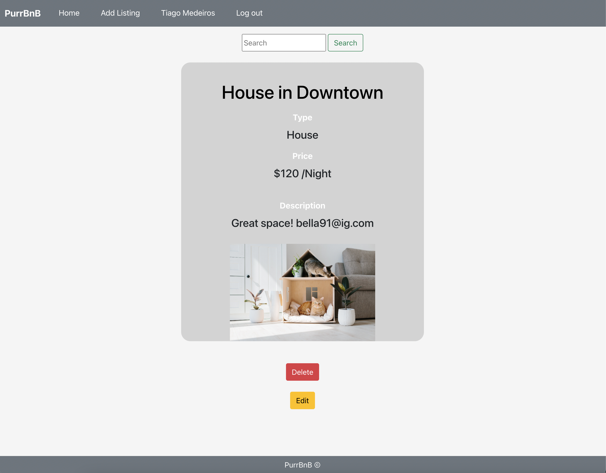
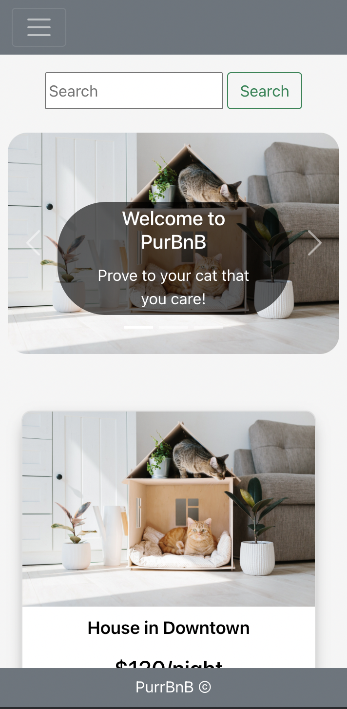

# PurrBnB
Welcome to the PurrBnB!

Purrbnb is a cat vacation rental solution with contemporary reatures to manage all your fuzzy friends listings.This is a way to seamlessly make reservations and add them to your listings for future stays!This is an online market place that eables users to sign up, both view and add listings all while enjoying adorable cats!

## Screenshots

## Technologies Used
React
*  HTML
CSS
Bootstrap
* JavaScript
* Mongoose
MongoDB
* MongoDB Atlas database
* Node JS
Express Webserver
Heroku
## Getting Started
### [Visit the app here](https://purrbnb.herokuapp.com)
* It’s simple and intuitive to use. This project uses single page application , meaning everything loads dynamically. 
* You can visualize all listings by clicking the home page. Once it’s done, the page will dynamically load without refreshing bringing you the current listings and our map.
* On your user add listing page, you also have the chance of adding your own listing page that will appear on the homepage along with listings added by other users.
* To view your listings you go to the page with your user name / profile page and it will be visible under "My Listings".You can also delete/edit from there as well.  
* Once you’ve clicked on “My Listings”, a new window will be shown where you have the opportunity to view all your previous listings.
